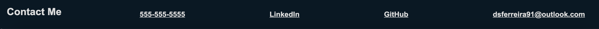
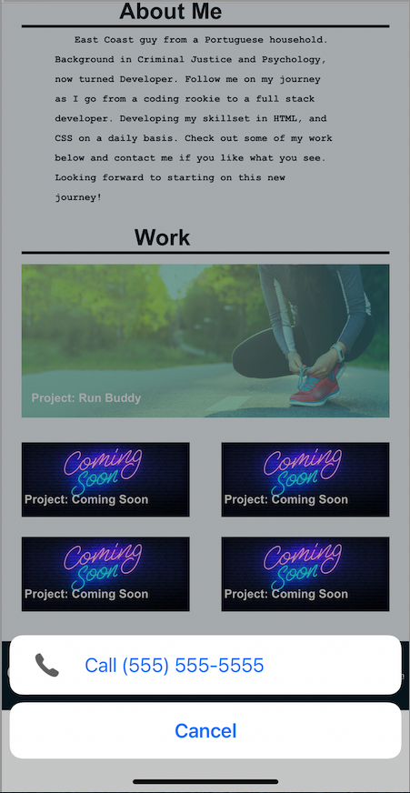
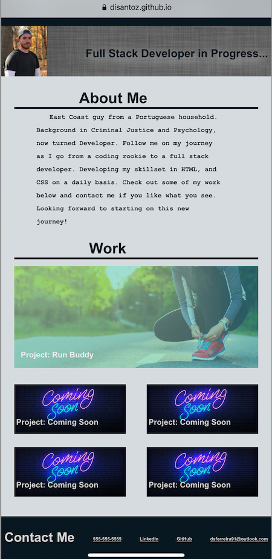

# First-Portfolio-V1

## Description

Using HTML and CSS I developed my first portfolio :tada: which provides potential employers with access to my contact information, as well as the ability to view projects I've worked on.

This portfolio exhibits my skill in use of flexbox as well as media query to allow users to view my portfolio across several devices :computer: :iphone:.

This portfolio will be updated frequently as I develop more projects and further improve my skillset in HTML, CSS and other programming languages. 

Check out my [portfolio](https://disantoz.github.io/First-Portfolio-V1/)! Reach out to me via the contact information on my portfolio if you want to connect, offer advice on how I can improve my portfolio or offer advice on how I can be a better developer.

## Usage

The portfolio header redirects to different sections of the page for ease of use.

When the Resume tab is clicked, you will be redirected to a Google Doc containing my resume.

When tabs in the header are hovered over, the tab will turn brighter to stand out.

Likewise, when hovering over the work tiles, the images will highlight and allow you to click anywhere on the tile to open the corresponding project on a different tab.

**BEFORE**

**AFTER**

The "Coming Soon" tiles will also highlight but will not deploy a project when click, as these are placeholders for future projects that will be developed.

The Contact Me section, which can be reached by clicking the corresponding tab on the navigation bar or by simply scrolling down, will present you with 4 ways I can be reached.

The phone number, when clicked will offer an option to call immediately from your phone.

Likewise, the email address will open your default email client with my email address already pasted in the "TO" area.

Clicking on GitHub tab will take you to my personal GitHub where you can go deeper and view the code behind my projects. 

While the Linkedin tab will redirect you in a seperate tab to my LinkedIn profile where you can connect with me!

Finally, you may open this portfolio on a number of devices, you won't be limited to only a desktop! 

Here's how the portfolio will look like on an iPhone :

## License

MIT License

Copyright (c) [2021] [DiSantoz]

Permission is hereby granted, free of charge, to any person obtaining a copy
of this software and associated documentation files (the "Software"), to deal
in the Software without restriction, including without limitation the rights
to use, copy, modify, merge, publish, distribute, sublicense, and/or sell
copies of the Software, and to permit persons to whom the Software is
furnished to do so, subject to the following conditions:

The above copyright notice and this permission notice shall be included in all
copies or substantial portions of the Software.

THE SOFTWARE IS PROVIDED "AS IS", WITHOUT WARRANTY OF ANY KIND, EXPRESS OR
IMPLIED, INCLUDING BUT NOT LIMITED TO THE WARRANTIES OF MERCHANTABILITY,
FITNESS FOR A PARTICULAR PURPOSE AND NONINFRINGEMENT. IN NO EVENT SHALL THE
AUTHORS OR COPYRIGHT HOLDERS BE LIABLE FOR ANY CLAIM, DAMAGES OR OTHER
LIABILITY, WHETHER IN AN ACTION OF CONTRACT, TORT OR OTHERWISE, ARISING FROM,
OUT OF OR IN CONNECTION WITH THE SOFTWARE OR THE USE OR OTHER DEALINGS IN THE
SOFTWARE.

