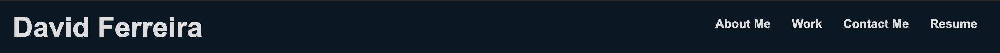
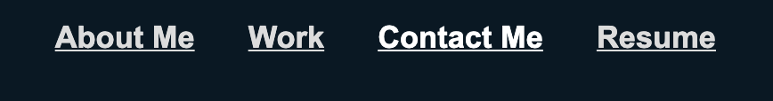
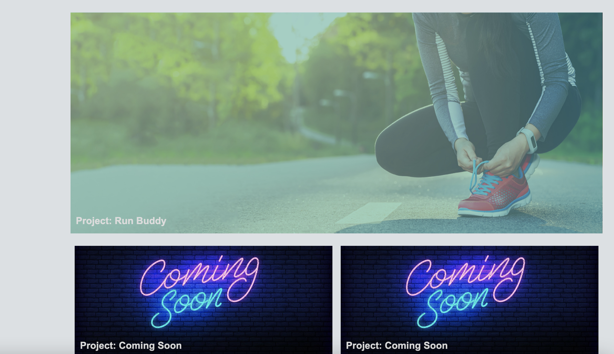
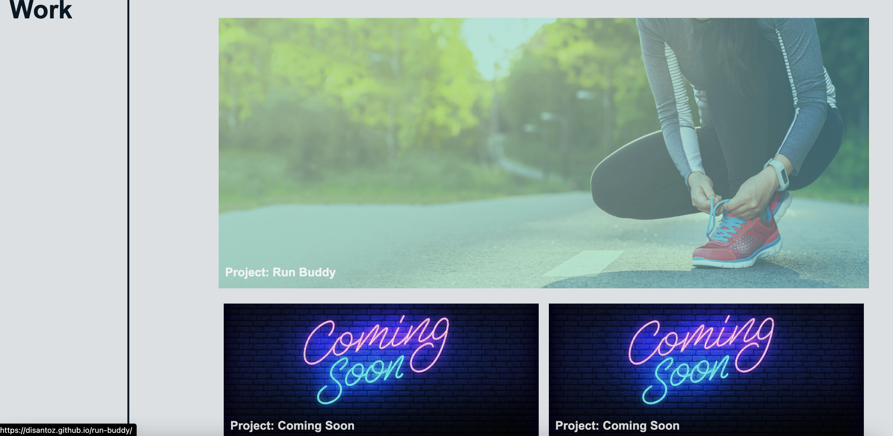
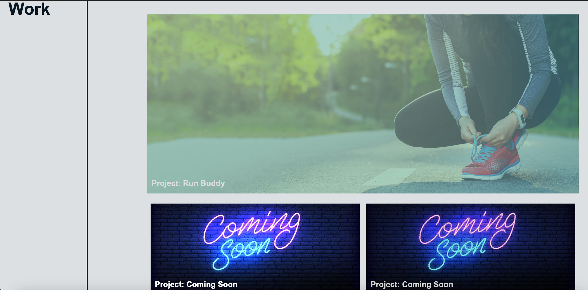

# First-Portfolio-V1

## Description

Using HTML and CSS I developed my first portfolio :tada: which provides potential employers with access to my contact information, as well as the ability to view projects I've worked on.

This portfolio exhibits my skill in use of flexbox as well as media query to allow users to view my portfolio across several devices :computer: :iphone:.

This portfolio will be updated frequently as I develop more projects and further improve my skillset in HTML, CSS and other programming languages. 

Check out my [portfolio](https://disantoz.github.io/First-Portfolio-V1/)! Reach out to me via the contact information on my portfolio if you want to connect, offer advice on how I can improve my portfolio or offer advice on how I can be a better developer.

## Usage

The portfolio header redirects to different sections of the page for ease of use.

When the Resume tab is clicked, you will be redirected to a Google Doc containing my resume.

When tabs in the header are hovered over, the tab will turn brighter to stand out.

Likewise, when hovering over the work tiles, the images will highlight and allow you to click anywhere on the tile to open the corresponding project on a different tab.

**BEFORE**

**AFTER**

The "Coming Soon" tiles will also highlight but will not deploy a project when click, as these are placeholders for future projects that will be developed.

